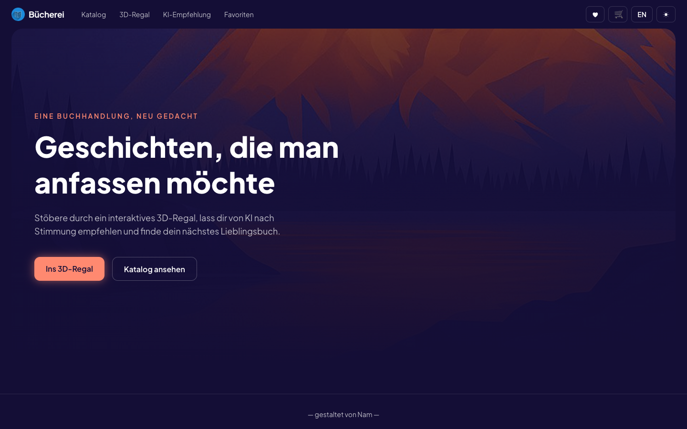
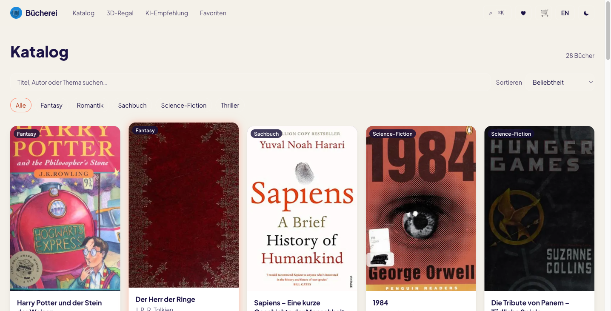
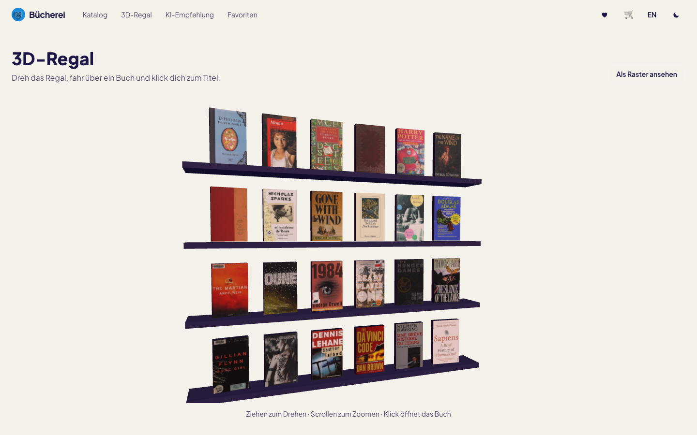
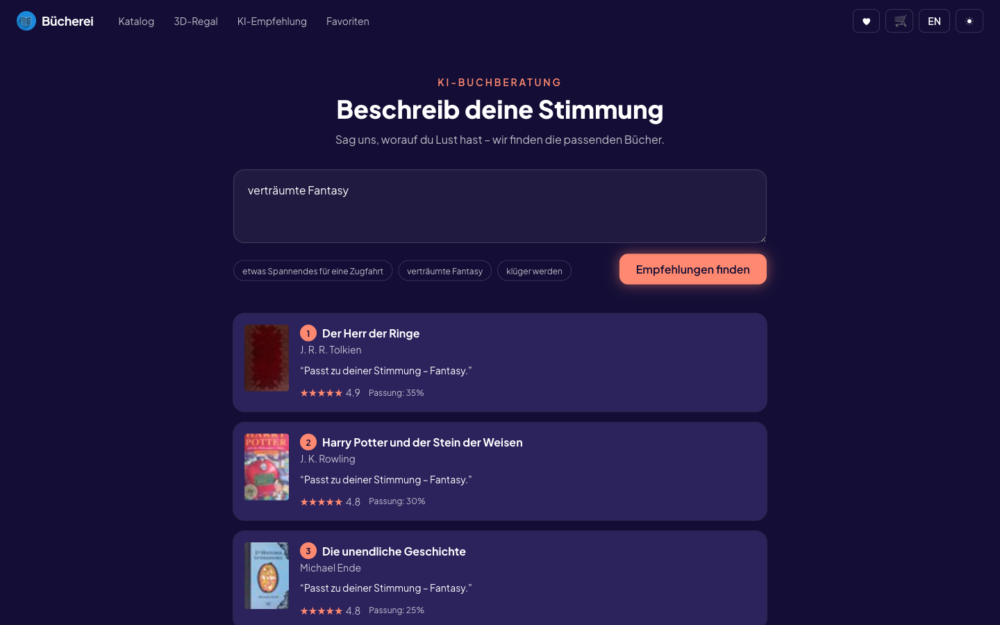
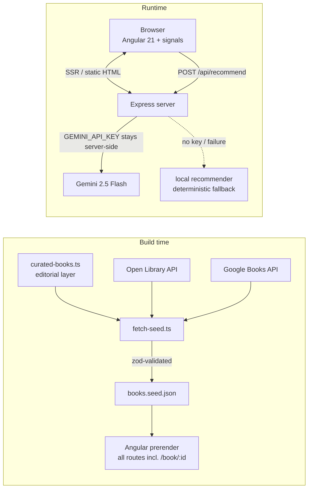

# 📚 Bookstore — Stories you can touch

A bilingual (DE/EN) bookstore experience built with **Angular 21**: server-side rendering, signal-based state, an interactive **Three.js 3D bookshelf**, and an **AI book recommender** powered by Gemini behind a server-side BFF.

**🔗 Live demo:** _deploying to Render — link coming shortly_

[](https://github.com/tranqn/bookstore/actions/workflows/ci.yml)
[](https://angular.dev)
[](LICENSE)

| Home (dark) | Catalog (light) |
| --- | --- |
|  |  |

| 3D bookshelf (Three.js) | AI recommender |
| --- | --- |
|  |  |

## Highlights

- **Angular 21 SSR + hydration with event replay** — Express server, all routes prerendered at build time (every book detail page ships as static HTML), `withEventReplay()` so no click is lost before hydration.
- **Signal-based state management** — six `@ngrx/signals` stores (catalog with entities, cart, favorites, reviews, UI, AI) with `computed()` pipelines and localStorage persistence via effects.
- **AI recommender with a real fallback story** — the browser never sees an API key: a server-side BFF (`POST /api/recommend`) calls Gemini 2.5 Flash with the catalog as grounding context, validates the response with zod, and filters hallucinated book IDs. No key or API failure? A deterministic local recommender takes over seamlessly.
- **Three.js 3D bookshelf** — raycaster hover, orbit controls, genre-tinted spines, loaded via `@defer (on viewport)`; falls back to a regular grid under SSR, missing WebGL, or `prefers-reduced-motion`.
- **Motion that respects users** — GSAP entrance timelines + Lenis smooth scrolling, dynamically imported after hydration and fully disabled for reduced-motion users.
- **Bilingual & themeable** — Transloco (DE/EN) with persisted locale, dark/light theme on Tailwind v4 design tokens with WCAG AA contrast.
- **Typed end to end** — strict TypeScript, zod-validated seed data, no `any`.
- **Quality gates in CI** — eslint (zero warnings), Vitest unit tests, 21 Playwright E2E tests including **automated axe WCAG-AA audits of every route in both themes**, and Lighthouse budget assertions.
- **Lighthouse (desktop): 100/100/100/100 on home** — 98–99 performance on the image-heavy routes, everything else 100. Enforced continuously via Lighthouse CI.

## Architecture



## Engineering decisions

- **BFF instead of client-side AI calls** — the Gemini key lives only in the server environment; the client talks to `/api/recommend`. Responses are schema-validated and recommendations are filtered against real catalog IDs to guard against hallucinations.
- **Prerendering over per-request SSR** — the catalog is known at build time, so every route (including all 55+ book detail pages) is rendered to static HTML for instant first paint; Express serves static assets and the AI endpoint.
- **`@defer` for the 3D scene** — Three.js never blocks initial load; it streams in when the gallery scrolls into view, with placeholder/loading states and a non-WebGL fallback grid.
- **Editorial data + API enrichment** — book metadata is hand-curated (bilingual descriptions, pricing), while covers/ISBNs are fetched once at build time from Open Library/Google Books and validated with zod — no runtime dependency on third-party APIs for the core experience.
- **Signals everywhere, OnPush everywhere** — zero `*ngIf`/`*ngFor`, native control flow, `input()`/`computed()`, all 15+ components `OnPush`.
- **Accessibility as a requirement, not a feature** — skip link, `aria-live` result counts, focus-visible styles, reduced-motion fallbacks for every animation, WCAG AA contrast documented in the design tokens.

## Running locally

```bash
npm ci
npm start            # dev server on http://localhost:4200
```

The AI recommender works out of the box via the local fallback. To enable Gemini:

```bash
GEMINI_API_KEY=your-key npm start
```

| Script | What it does |
| --- | --- |
| `npm start` | Dev server with HMR |
| `npm run build` | Production build (SSR + prerender) |
| `npm run serve:ssr:bookstore` | Serve the production build |
| `npm run test` / `npm run test:ci` | Vitest unit tests (watch / single run) |
| `npm run e2e` | Playwright E2E + axe accessibility audits against the production build |
| `npm run lint` | angular-eslint (template a11y rules included) |
| `npm run seed` | Regenerate book seed data from Open Library/Google Books |
| `npm run optimize:covers` | Self-host covers as WebP renditions + LQIP placeholders |
| `npm run sitemap` | Regenerate `public/sitemap.xml` from the seed |

## Deployment

Deployed on [Render](https://render.com) as a Node web service — see [`render.yaml`](render.yaml). `GEMINI_API_KEY` is configured in the Render dashboard; the app degrades gracefully without it.

## Project history

This is a ground-up remake of a vanilla-JS bookstore (preserved in [`legacy/`](legacy/)) — from a single static page with hardcoded data to a prerendered, bilingual, AI-assisted storefront. Same shop, two generations of frontend.

## Roadmap

- [x] Shared-element view transitions (catalog → book detail)
- [x] ⌘K command palette
- [x] Self-hosted WebP covers with LQIP placeholders + `NgOptimizedImage`
- [x] schema.org `Book` JSON-LD, Open Graph cards, sitemap
- [x] Playwright E2E + automated axe accessibility audits in CI
- [ ] Streaming AI recommendations (NDJSON)
- [ ] In-app "How it's built" page for the technically curious
- [ ] Installable PWA with offline catalog
- [ ] 3D shelf deep-linking from search

---

Built by **Quoc Nam Tran** — frontend developer (Angular/TypeScript), Germany. 🇩🇪🇬🇧
